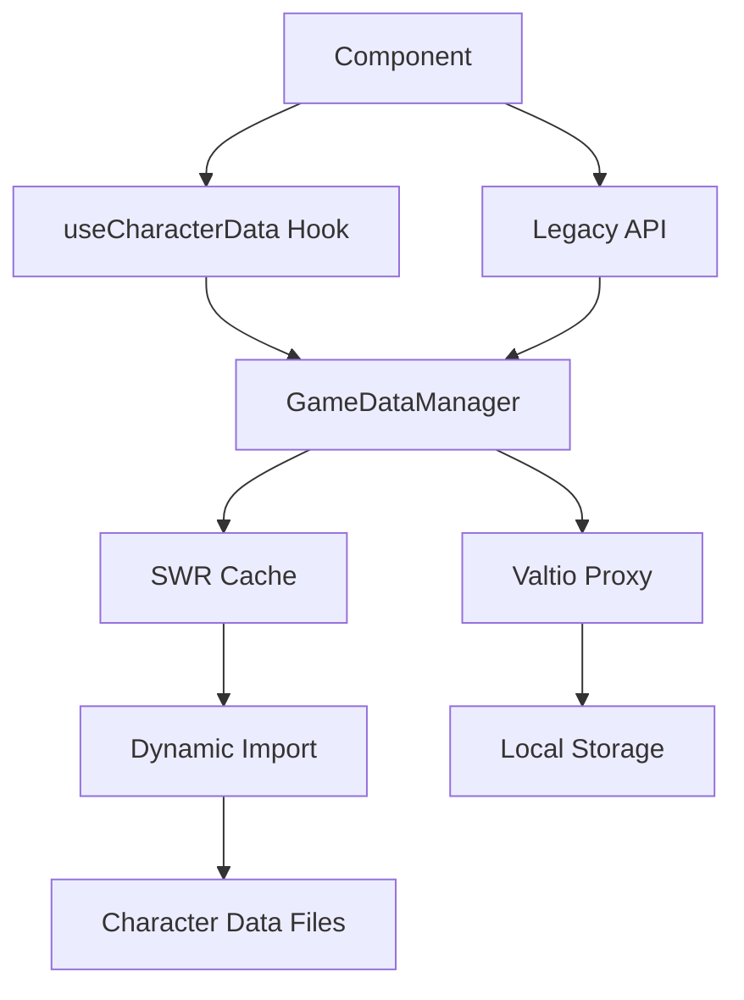

# Design Document

## Overview

This design implements a data chunking and lazy loading system for the Tom and Jerry Chase Wiki to optimize performance by loading character data on-demand rather than all at once. The solution maintains backward compatibility while introducing efficient data loading patterns using dynamic imports, SWR for caching, and React hooks for state management.

## Architecture

### Current Architecture Issues

- All character data is loaded statically at application startup
- Large bundle size due to embedded character data
- Memory usage includes unused faction data
- No caching strategy for data updates

### New Architecture

The new system introduces a three-layer architecture:

1. **Data Loading Layer**: Dynamic imports with SWR caching
2. **Data Management Layer**: Enhanced GameDataManager with lazy loading
3. **Component Interface Layer**: React hooks and backward-compatible APIs



## Components and Interfaces

### 1. Data Loading Hooks

#### useCharacterData Hook

```typescript
interface UseCharacterDataOptions {
  factionId?: FactionId;
  characterId?: string;
  preload?: boolean;
}

interface UseCharacterDataReturn {
  data: Record<string, CharacterWithFaction> | undefined;
  isLoading: boolean;
  error: Error | undefined;
  mutate: () => Promise<void>;
}

function useCharacterData(options?: UseCharacterDataOptions): UseCharacterDataReturn;
```

#### useFactionData Hook

```typescript
interface UseFactionDataReturn {
  data: FactionWithCharacters | undefined;
  isLoading: boolean;
  error: Error | undefined;
  mutate: () => Promise<void>;
}

function useFactionData(factionId: FactionId): UseFactionDataReturn;
```

### 2. Enhanced GameDataManager

#### Dynamic Loading Methods

```typescript
class GameDataManager {
  // New dynamic loading methods
  static async loadFactionCharacters(factionId: FactionId): Promise<Record<string, Character>>;
  static async loadCharacter(characterId: string): Promise<CharacterWithFaction>;
  static async preloadFactionData(factionId: FactionId): Promise<void>;

  // Enhanced existing methods with lazy loading
  static getCharacters(): Promise<Record<string, CharacterWithFaction>>;
  static getFactions(): Promise<Record<string, FactionWithCharacters>>;

  // Cache management
  static invalidateCache(factionId?: FactionId): void;
  static getCacheStatus(): CacheStatus;
}
```

### 3. Data Loading Service

#### DataLoadingService

```typescript
interface DataLoadingService {
  loadCharacterData(factionId: FactionId): Promise<Record<string, Character>>;
  preloadData(factionId: FactionId): Promise<void>;
  getCachedData(factionId: FactionId): Record<string, Character> | null;
  invalidateCache(factionId?: FactionId): void;
}
```

## Data Models

### Loading State Management

```typescript
interface LoadingState {
  isLoading: boolean;
  error: Error | null;
  lastLoaded: Date | null;
  cacheHit: boolean;
}

interface CacheStatus {
  cat: LoadingState;
  mouse: LoadingState;
  totalSize: number;
  hitRate: number;
}
```

### Data Chunk Structure

```typescript
interface DataChunk {
  factionId: FactionId;
  characters: Record<string, Character>;
  metadata: {
    version: string;
    loadedAt: Date;
    size: number;
  };
}
```

## Error Handling

### Error Types

```typescript
enum DataLoadingErrorType {
  NETWORK_ERROR = 'NETWORK_ERROR',
  PARSE_ERROR = 'PARSE_ERROR',
  CACHE_ERROR = 'CACHE_ERROR',
  TIMEOUT_ERROR = 'TIMEOUT_ERROR',
}

interface DataLoadingError extends Error {
  type: DataLoadingErrorType;
  factionId?: FactionId;
  retryable: boolean;
  retryCount: number;
}
```

### Error Recovery Strategy

1. **Network Errors**: Retry with exponential backoff (3 attempts)
2. **Parse Errors**: Fall back to cached data if available
3. **Cache Errors**: Clear corrupted cache and reload
4. **Timeout Errors**: Show loading state and retry

### Fallback Mechanisms

- Serve stale data while revalidating in background
- Progressive loading with skeleton screens
- Graceful degradation to basic functionality

## Testing Strategy

### Unit Tests

- Data loading hooks behavior
- GameDataManager lazy loading methods
- Error handling and retry logic
- Cache invalidation and management

### Integration Tests

- End-to-end data loading flows
- Component integration with new hooks
- Backward compatibility with existing components
- Performance benchmarks

### Performance Tests

- Bundle size analysis before/after
- Loading time measurements
- Memory usage profiling
- Cache hit rate monitoring

### Test Data Strategy

- Mock dynamic imports for testing
- Simulate network conditions
- Test cache scenarios (hit/miss/stale)
- Error condition simulation

## Implementation Phases

### Phase 1: Foundation (Week 1)

- Implement basic data loading hooks
- Create enhanced GameDataManager methods
- Set up SWR configuration and caching

### Phase 2: Integration (Week 2)

- Integrate hooks with existing components
- Implement backward compatibility layer
- Add error handling and loading states

### Phase 3: Optimization (Week 3)

- Add preloading and prefetching
- Implement cache management
- Performance monitoring and metrics

### Phase 4: Testing & Refinement (Week 4)

- Comprehensive testing suite
- Performance benchmarking
- Documentation and migration guide

## Performance Targets

### Bundle Size Reduction

- **Target**: 30-50% reduction in initial bundle size
- **Method**: Move character data to dynamic chunks
- **Measurement**: Webpack bundle analyzer

### Loading Performance

- **Target**: <200ms for cached data, <500ms for fresh data
- **Method**: SWR caching with stale-while-revalidate
- **Measurement**: Performance monitoring hooks

### Memory Usage

- **Target**: Load only required faction data
- **Method**: Lazy loading and garbage collection
- **Measurement**: Browser memory profiler

### Cache Efficiency

- **Target**: >80% cache hit rate for repeat visits
- **Method**: Intelligent caching with proper invalidation
- **Measurement**: Custom analytics tracking

## Migration Strategy

### Backward Compatibility

- Maintain existing `characters` and `factions` proxy objects
- Provide loading states for components expecting immediate data
- Gradual migration path for components to use new hooks

### Component Migration

1. **Phase 1**: Critical path components (character grids, details)
2. **Phase 2**: Secondary components (search, filters)
3. **Phase 3**: Utility components and edge cases

### Data Migration

- No data structure changes required
- Maintain existing data file formats
- Add metadata for versioning and cache management
